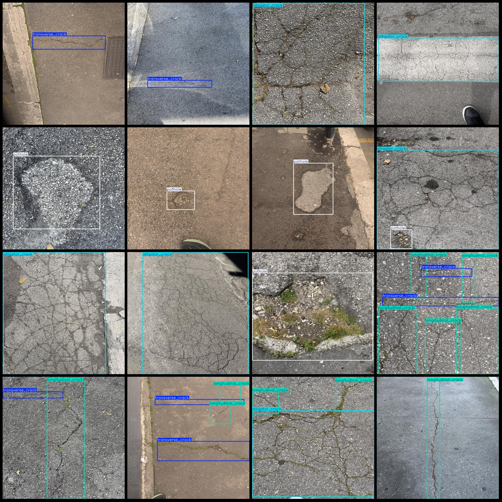
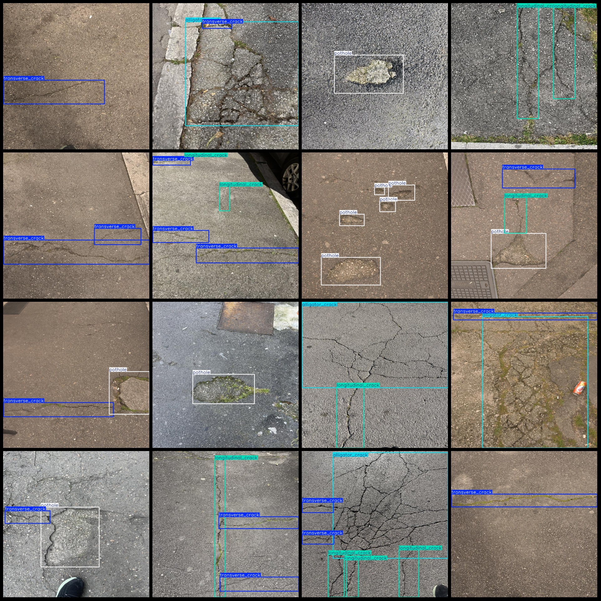

# City Road Roadway Cracks Detection Dataset (VOC+YOLO) Format: 1023 Images, 4 Categories

Dataset format: Pascal VOC format + YOLO format (txt files without split paths, only containing jpg images and corresponding VOC format xml files and YOLO format txt files)
Number of image files (jpg): 1023
Number of annotations (xml): 1023
Number of annotations (txt): 1023
Number of categories: 4
Annotation category names: ["alligator_crack", "longitudinal_crack", "pothole", "transverse_crack"]
Box count for each category:
- alligator_crack (cracks/webbing) = 304
- longitudinal_crack (longitudinal crack) = 646
- pothole (pit) = 537
- transverse_crack (lateral crack) = 687
Total box count: 2174
Number of images per category:
- alligator_crack (cracks/webbing) = 282
- longitudinal_crack (longitudinal crack) = 405
- pothole (pit) = 311
- transverse_crack (lateral crack) = 480
Image resolution: 640x640
Annotation tool used: labelImg
Annotation rules: draw bounding boxes for each category
Important note: The dataset does not have a division into training, validation, or test sets; you will need to manually divide them.
Special declaration: This dataset does not guarantee the accuracy of models trained on it or any weights file.
Image preview:
Annotation example:

## Images

Here is a pay link on Stripe ( https://buy.stripe.com/3cs8yP7sY87d0vu9AB ). Please contact me lonlonago@foxmail.com after funding $89, and I will send you a complete data files , thank you!

